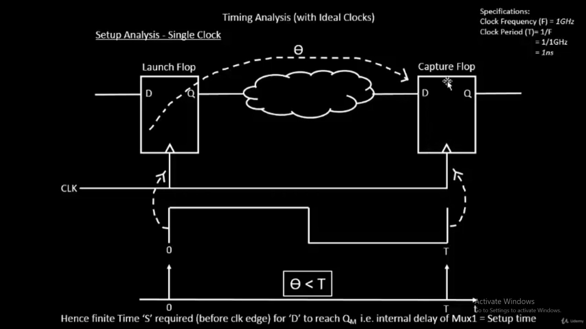
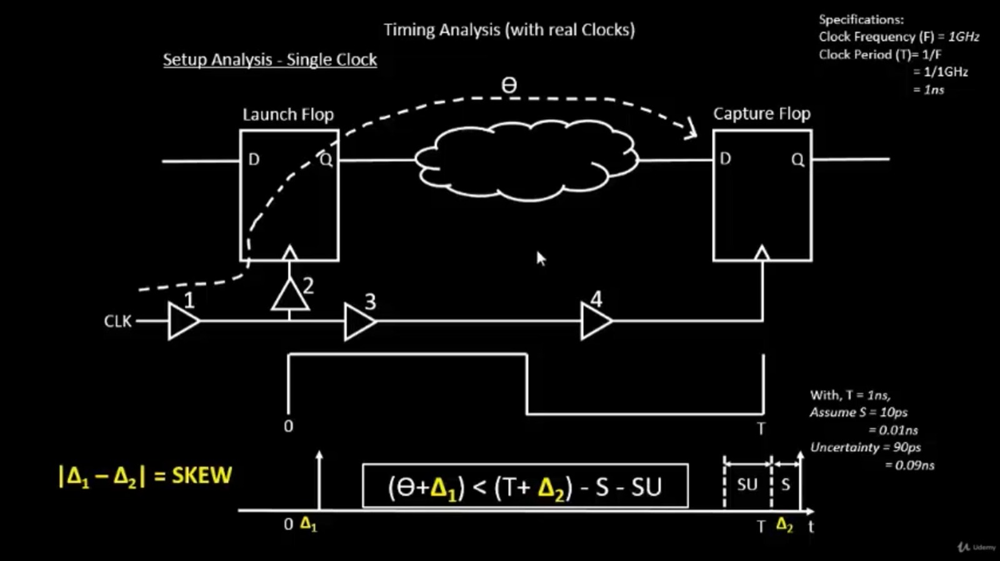
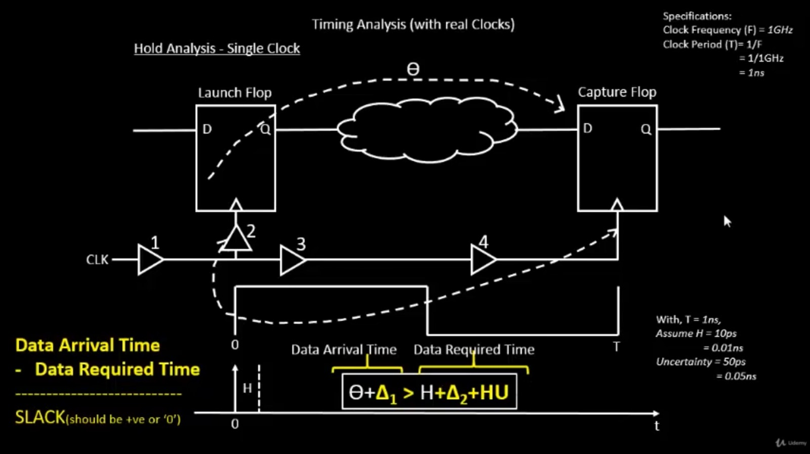
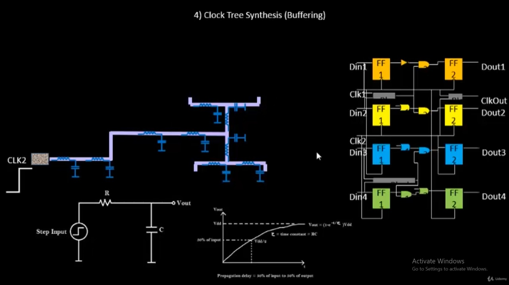
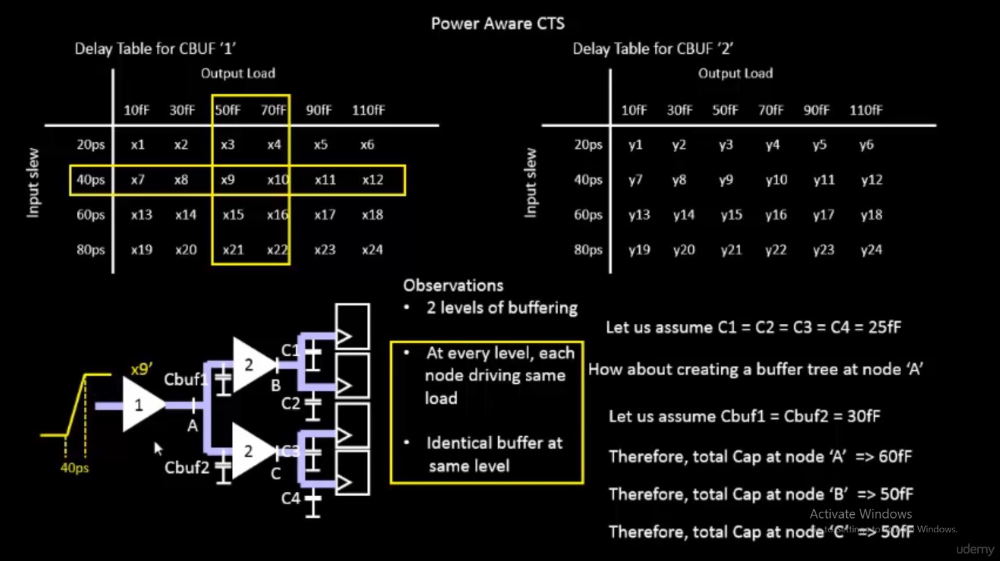
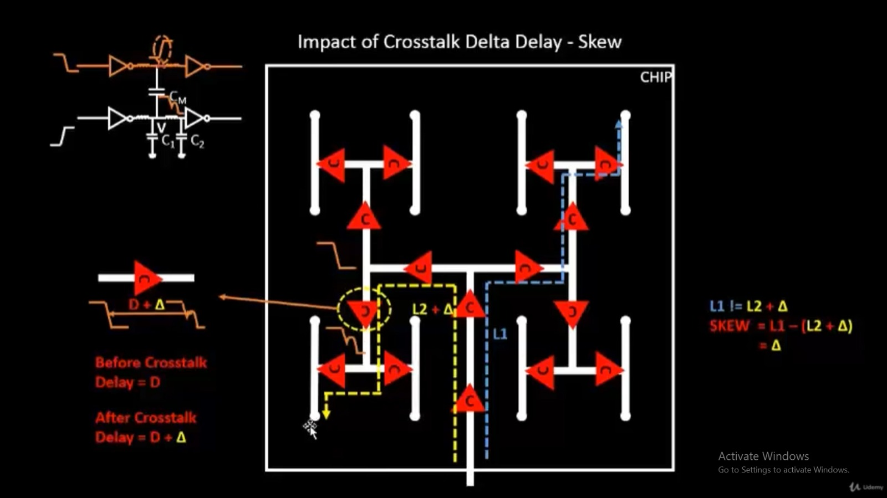
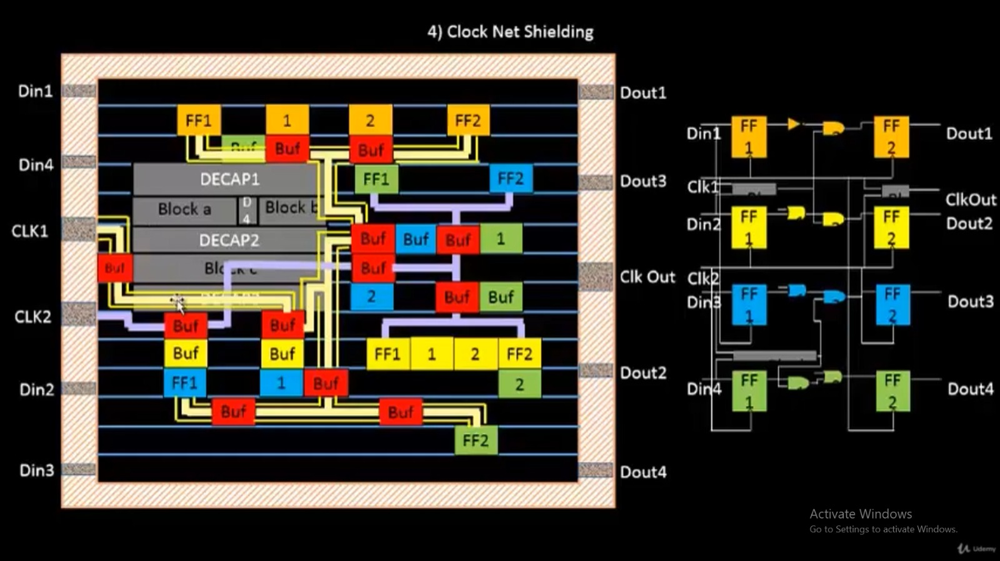
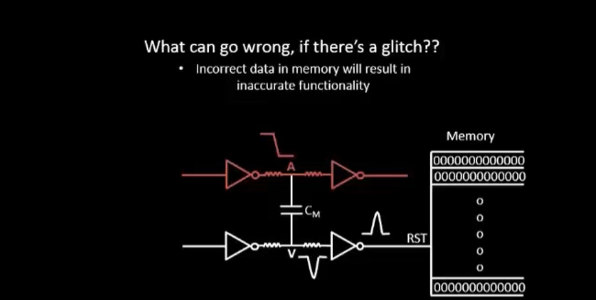
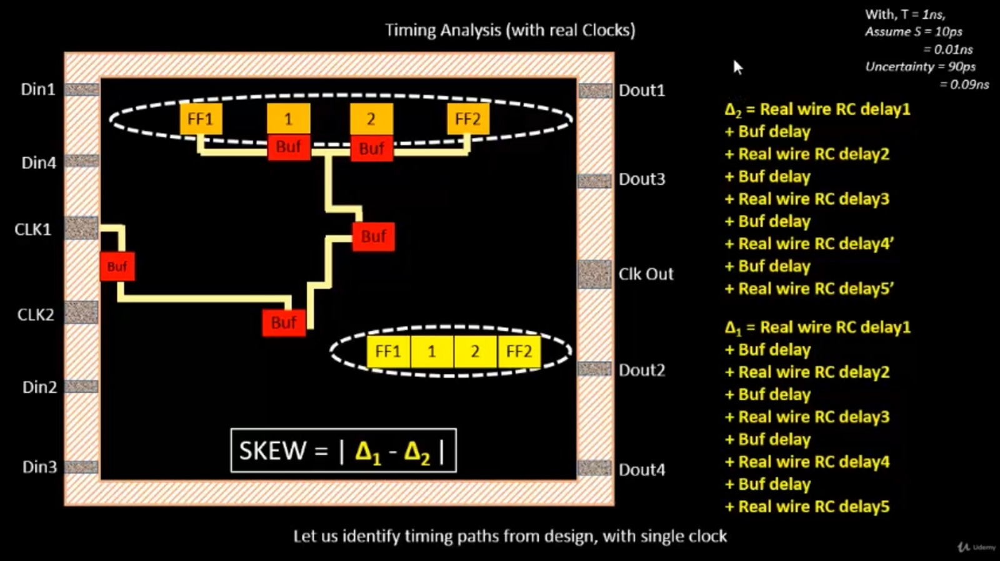

# Module 4 — Custom Standard Cell Integration, Timing Analysis & Clock Tree Synthesis

This module covers the full path from a hand-crafted standard cell (LEF extraction) through
synthesis, root-cause timing debugging, manual buffer upsizing, Clock Tree Synthesis (CTS),
and post-CTS Static Timing Analysis (STA) — executed on the `picorv32a` design in OpenLane,
using the SKY130 PDK.

Theory is presented first for each concept, followed immediately by the corresponding real
execution on this design. Execution screenshots are linked (not embedded) per the established
convention from Modules 1–3. Theory diagrams are embedded inline.

---

## Part 1 — LEF Extraction & PR Guideline Theory

To integrate a custom-drawn standard cell (`sky130_vsdinv`, a custom inverter) into an
OpenLane-based flow, the cell must satisfy Place-and-Route (PR) guidelines before a valid
LEF (Library Exchange Format) file can be generated:

- **Ports must sit on track intersections.** The routing grid is defined per metal layer
  (pitch and offset in X/Y). A pin not aligned to this grid cannot be reliably accessed by
  the router on that layer.
- **Cell width and height should be odd multiples of the track pitch**, so that cell
  boundaries align consistently when cells are abutted in a row.
- **Port `class` and `use` attributes must be set correctly** before writing the LEF —
  `class` describes electrical behavior (input / output / inout / power / ground) and `use`
  describes purpose (signal / power / ground / clock). Without these, downstream tools
  (placement, routing, STA) cannot interpret the pins correctly.
- **The cell must be renamed from its default/template name** to a unique, final name
  before `lef write`, so it doesn't collide with existing library cells during LEF merge.

### Execution — Confirming Track Pitch

The track pitch values for each metal layer were read directly from the PDK's `tracks.info`
file to determine the grid the custom cell's ports must align to:

[01 — tracks.info confirmation](images/01_tracks_info_confirmation.jpeg)

```
li1 X 0.23 0.46      li1 Y 0.17 0.34
met1 X 0.17 0.34     met1 Y 0.17 0.34
met2 X 0.23 0.46     met2 Y 0.23 0.46
met3 X 0.34 0.68     met3 Y 0.34 0.68
met4 X 0.46 0.92     met4 Y 0.46 0.92
met5 X 1.70 3.40     met5 Y 1.70 3.40
```

### Execution — Setting the Magic Grid

Using these values, the Magic layout grid was set to match the li1 layer pitch/offset so
that all subsequent port placement snaps to valid track intersections:

[02 — Grid setup in Tkcon](images/02_grid_setup_tkcon.jpeg)

```tcl
grid 0.46um 0.34um 0.23um 0.17um
```

### Execution — Port Class & Use Configuration

Each of the 4 ports on the custom inverter (`VPWR`, `VGND`, `A`, `Y`) was selected in Magic
and assigned the correct `port class` and `port use`, via hover-select + `s` + Tkcon commands:

| Port | Class | Use |
|------|-------|-----|
| VPWR | inout | power |
| VGND | inout | ground |
| A | input | signal |
| Y | output | signal |

[03 — Port config: VPWR / VGND (power/ground)](images/03_port_config_power_ground.jpeg)

[04 — Port config: A / Y (signal pins)](images/04_port_config_signal_pins.jpeg)

### Execution — Cell Resize, DRC Warning, Rename & LEF Write

The cell box was resized to match the target dimensions from the real workshop's published
LEF: **1.380 µm × 2.720 µm**. Resizing landed exactly on this target.

During this process, a DRC warning was raised: `Transistor width < 0.42um` (diff/tap layer).
This was left **unresolved** as a known, flagged risk for this session — it does not block
LEF generation but should be revisited if downstream DRC/LVS issues appear.

The cell was then renamed from its working name to the final name **`sky130_vsdinv`**, and
`lef write` was run, producing `sky130_vsdinv.lef`. This file is included in
[`output_files/sky130_vsdinv.lef`](output_files/sky130_vsdinv.lef).

*(Screenshots for the resize/DRC-warning/rename/write terminal steps specifically were not
preserved this session — the resulting LEF file itself, listed above, is the artifact of
this step and was verified further downstream — see LEF merge confirmation below.)*

The final LEF, along with 3 supporting `.lib` files, was copied into
`designs/picorv32a/src/`.

---

## Part 2 — OpenLane Integration

### Execution — Config Fix, Prep, and LEF Merge Confirmation

A `config.tcl` ordering bug was fixed so that `LIB_SYNTH` would not be silently overwritten
by the PDK default value. The relevant run-level config is included in
[`output_files/config.tcl`](output_files/config.tcl).

OpenLane was launched and `prep -design picorv32a` was run, creating run directory
`26-09_13-34`. During this step, an unintended leftover file `sky130_inv.lef` was also
merged in alongside the intended `sky130_vsdinv.lef` (flagged as a cleanup TODO — did not
block the flow, but is not the intended custom cell).

The presence of the custom `sky130_vsdinv` MACRO in the merged LEF was confirmed directly:

[05 — merged.lef MACRO confirmation](images/05_merged_lef_macro_confirmation.png)

```
MACRO sky130_vsdinv
  FOREIGN sky130_vsdinv ;
END sky130_vsdinv
```

---

## Part 3 — Synthesis & Netlist Verification

### Execution — Running Synthesis

`run_synthesis` was executed successfully. Because the custom cell has no Liberty timing
model, it was correctly flagged as a **black box** in STA (expected — Liberty
characterization is a separate step not covered in this module). Initial slack numbers:

**TNS = −639.39 ns, WNS = −22.77 ns**

[06 — Synthesis output: TNS / WNS](images/06_synthesis_output_tns_wns.png)

[07 — Synthesis cell statistics (14876 total cells)](images/07_synthesis_cell_stats.png)

### Execution — Confirming Custom Cell Instantiation in the Netlist

A `grep` on the synthesized netlist confirmed real instantiations of `sky130_vsdinv`
(not a false substring match) — **1554 instances** total:

[08b — Netlist grep: instance count](images/08b_netlist_grep_instance_count.png)

[08 — Netlist grep + ABC mapping log](images/08_netlist_grep_abc_mapping.png)

This high instance count is explained by a specific mechanism: because the custom cell's
Liberty file provides no real timing/area characterization, Yosys/ABC's technology mapper
treats it as the cheapest available inverter option and substitutes it broadly across the
design wherever an inverter is needed — not just where the RTL explicitly instantiated it.
The ABC results log confirms this directly: `ABC RESULTS: sky130_vsdinv cells: 1554`.

---

## Part 4 — Setup/Hold Timing Theory

Every synchronous digital path must satisfy two timing conditions at the capture flip-flop:

**Setup timing** — data must arrive and remain stable *before* the active clock edge:



For a single-clock setup path, the fundamental relationship is:

```
(θ + Δ1) < (T + Δ2) − S − SU
```

where θ is combinational logic delay, Δ1/Δ2 are clock insertion delays at launch/capture,
T is the clock period, S is setup time, and SU is setup uncertainty.



**Hold timing** — data must remain stable for a minimum time *after* the capture edge:



```
Slack = Data Arrival Time − Data Required Time
```

Slack must be positive (or zero) for both setup and hold checks to pass. A negative slack
on either check is a timing violation requiring optimization.

### Execution — Root-Cause Investigation of the WNS Violation

Rather than assume the black-box custom cell was the cause of the reported WNS = −22.77 ns,
the actual worst path was traced through OpenSTA's post-synthesis timing report:

[09 — ABC critical path analysis](images/09_critical_path_abc_analysis.png)

```
Startpoint: _27862_ (flip-flop, clocked by clk)
Endpoint:   _27762_ (flip-flop, clocked by clk)
Path Type:  max (setup)
```

[10 — Worst path full detail (report_checks)](images/10_wns_worst_path_detail.png)

[11 — OR-gate chain continuation through the path](images/11_or_chain_continuation.png)

The path runs from `irq_mask[3]` through a very long serial chain of `or2_2` / `or3_2`
gates (roughly 65 cells in series), each adding ~0.28–0.3 ns, accumulating to ~21 ns of
pure logic-depth delay before reaching the capture flop. This confirmed the violation is a
**genuine excessive logic-depth setup violation** — a real synthesis/RTL structural issue,
not an artifact of the black-boxed custom cell (which appears only once, incidentally, in
this specific path).

[12 — Slack confirmed matching reported WNS: −22.77 ns / −21.94 ns (second endpoint)](images/12_wns_slack_confirmed.png)

---

## Part 5 — Timing Optimization: Manual Buffer/Cell Upsizing

When a setup violation is dominated by cell delay along a long chain (rather than by high
fanout or excessive wire length), one valid mitigation is **cell upsizing** — replacing a
weaker-drive-strength cell with a stronger one to reduce its individual propagation delay.

### Execution — Iterative Cell Upsizing (via OpenROAD/OpenSTA `replace_cell`)

Working directly in the OpenROAD interactive shell (inside the OpenLane Docker container),
the design was reloaded (`read_lef`, `read_liberty`, `read_verilog`, `link_design`,
`read_sdc`) and the real clock constraints (`core_clock`, 5 ns period) were applied.

**Round 1 — Manual upsize of 5 cells** (`or2_2` → `or2_4`) in the critical chain:

[13 — Slack after 5-cell upsize: −16.182 ns](images/13_after_5cell_upsize_slack.png)

**Round 2 — Bulk upsize** of the remaining `or2_2` instances in the same chain via a Tcl
`foreach` loop (checking `ref_name` before replacing, to skip already-upgraded cells):

[14 — Slack after bulk upsize round 1: −15.818 ns](images/14_after_bulk_upsize_round1.png)

Fixing the worst path exposed the *next*-worst path (a different endpoint, `_27628_`,
through a parallel OR-chain) — exactly the iterative pattern timing closure theory
predicts: optimizing one path shifts the critical path elsewhere.

[15 — Slack after bulk upsize round 2 (new endpoint exposed): −13.389 ns](images/15_after_bulk_upsize_round2.png)

**Round 3 — Upsizing the newly-exposed chain**, bringing the endpoint back to the original
`_27762_` target, now fully on `or2_4`:

[16 — Slack after bulk upsize round 3: −12.626 ns](images/16_after_bulk_upsize_round3.png)

**Result summary:**

| Stage | WNS (worst path) |
|---|---|
| Post-synthesis (baseline) | −22.77 ns |
| After manual upsize round 1 (5 cells) | −16.182 ns |
| After bulk upsize round 2 | −13.389 ns |
| After bulk upsize round 3 | −12.626 ns |

This demonstrates the buffer/cell-upsizing technique end-to-end on real data. Full timing
closure (bringing slack to 0 or positive) was not pursued to completion, given the root
cause is a structural logic-depth issue that would more properly be fixed via RTL/logic
restructuring rather than exhaustive per-cell upsizing — consistent with the class text's
own demonstration pattern (which showed the *technique*, not full closure).

---

## Part 6 — Clock Tree Synthesis (CTS) Theory

### The H-Tree Algorithm

CTS distributes a single clock source to every sequential element in the design while
minimizing **clock skew** (the difference in clock arrival time between elements). The
H-tree topology achieves this by recursively splitting the clock distribution into
physically balanced branches:



### Power-Aware CTS & Buffer Sizing

Clock buffers are selected using delay tables indexed by input slew and output load,
ensuring balanced rise/fall timing at every level of the tree:



### Execution — Running TritonCTS

Since raw `openroad`/`sta` commands require a placed design, `run_synthesis` → `run_floorplan`
→ `run_placement` were re-run in a fresh OpenLane interactive session (the run directory had
been inadvertently reset via an accidental `-overwrite` flag; synthesis and placement were
successfully reproduced with consistent results, confirming the flow's determinism):

[19 — Placement layout (auto-generated by KLayout)](images/19_placement_layout_klayout.png)

`run_cts` was then executed via OpenLane's TritonCTS integration:

[17 — CTS success: WNS / TNS + clock skew table](images/17_cts_success_wns_tns_skew.png)

[20 — Post-CTS layout (auto-generated by KLayout)](images/20_cts_layout_klayout.png)

**Result: CTS succeeded**, producing:

- **Post-CTS WNS: −16.55 ns, TNS: −388.99 ns** (raw, ideal-clock-relative)
- Real clock skew reported directly by the tool:

```
Clock clk
Latency      CRPR      Skew
_27177_/CLK ^  4.74
_26381_/CLK ^  1.35      0.00      3.39
```

This confirms a measured clock skew of **3.39 ns** between these two flop clock pins —
the practical equivalent of the `report_clock_skew` step shown in the class text.

The post-CTS `.def` file is included at
[`output_files/picorv32a_cts.def`](output_files/picorv32a_cts.def).

---

## Part 7 — Clock Net Shielding Theory

Clock nets switch every cycle and drive many downstream elements, making them especially
sensitive to **crosstalk-induced delta delay**, which manifests as clock skew or glitches:



Shielding the clock net with adjacent VDD/GND wires reduces coupling capacitance from
neighboring signal wires, improving delay predictability:



A glitch on a clock or reset-adjacent net can cause spurious writes to sequential storage,
corrupting design state:



Formally, skew between two clock endpoints in a real buffered tree accumulates from the
sum of individual buffer delays and real (RC-extracted) wire delays along each branch:



*(Clock net shielding was not separately implemented as a standalone execution step in this
session — CTS's own buffer insertion and the measured skew above are the closest executed
equivalent; explicit shield-wire insertion was out of scope for the time available.)*

---

## Part 8 — Post-CTS Static Timing Analysis

### Execution — Post-CTS STA with Propagated Clock

`run_sta` was executed to recompute timing with the clock now treated as **propagated**
(i.e., using real CTS-derived insertion delays and skew) rather than ideal:

[18 — Post-CTS run_sta: WNS / TNS](images/18_post_cts_run_sta.png)

**Result: WNS = −13.64 ns, TNS = −269.12 ns**

This is an improvement over both the raw post-CTS numbers and the pre-CTS baseline,
demonstrating that CTS itself — independent of further manual fixes — measurably improved
timing by properly balancing clock arrival times.

**Full timing progression across this module:**

| Stage | WNS | TNS |
|---|---|---|
| Post-synthesis (baseline) | −22.77 ns | −639.39 ns |
| After manual/bulk upsizing (3 rounds) | −12.626 ns | — |
| Post-floorplan/placement (fresh run) | −24.09 ns | −702.78 ns |
| Post-CTS (raw, ideal-relative) | −16.55 ns | −388.99 ns |
| Post-CTS (propagated clock, `run_sta`) | **−13.64 ns** | **−269.12 ns** |

*(Note: the placement-stage numbers reflect a fresh, unoptimized run reproduced after the
accidental `-overwrite`, so they are not directly the same run as the upsized numbers from
Part 5 — both are documented here for transparency rather than merged into one misleading
progression.)*

Detailed OpenSTA report files (`.rpt`) for each synthesis STA checkpoint (pre-resizer,
post-resizer, final) are included under
[`output_files/reports/synthesis/`](output_files/reports/synthesis/).

---

## Known Issues & Open Risks

- **DRC warning** (`Transistor width < 0.42um`, diff/tap layer) on the custom cell layout —
  flagged, not resolved. Should be revisited if LVS/DRC issues appear downstream.
- **Stray `sky130_inv.lef`** was inadvertently merged alongside the intended
  `sky130_vsdinv.lef` during `prep`. Did not block the flow but is a cleanup TODO.
- **`repair_clock_nets` / `repair_hold_violations`** were not run in this session, due to
  time constraints. Noted as pending, consistent with the original execution scope.
- **Full timing closure** (positive slack) was not achieved — the dominant setup violation
  is a structural logic-depth issue in the RTL/synthesis result, better addressed through
  logic restructuring than exhaustive manual cell upsizing.
- **Routing** was explicitly out of scope for this module (matching the class text's own
  stopping point at post-CTS STA + skew) and was not executed.
- **Custom cell Liberty characterization** was never performed — `sky130_vsdinv` remained a
  timing black box (with its `.lib` file's characterization values, if any, unverified)
  throughout synthesis, CTS, and STA. This is explicitly flagged as a limitation rather than
  silently glossed over, since it affects the accuracy of any path passing through the cell.

---

## Output Files

Real generated artifacts from this session are included under `output_files/`:

- `sky130_vsdinv.lef` — the custom cell's final LEF file
- `config.tcl` — run-level OpenLane configuration
- `picorv32a_synthesis.v` — synthesized gate-level netlist
- `picorv32a_cts.def` — post-CTS placed & clock-tree-synthesized DEF
- `reports/synthesis/` — full set of Yosys and OpenSTA reports (pre-resizer, post-resizer,
  and final synthesis STA checkpoints: timing, min/max, slew, WNS, TNS)

---

## Summary

This module took a hand-extracted custom standard cell from LEF creation through a complete,
honest timing-closure narrative: real synthesis output, genuine root-cause debugging of a
severe setup violation (tracing it to actual logic depth rather than assuming it was the
black-boxed custom cell), incremental buffer/cell upsizing with measured improvement at each
step, successful Clock Tree Synthesis with real measured skew, and post-CTS STA with
propagated-clock timing. Where steps were not completed (hold repair, full closure, routing,
Liberty characterization of the custom cell), this is documented explicitly rather than
omitted, consistent with treating timing closure as the iterative, multi-stage engineering
process the theory describes it as.
