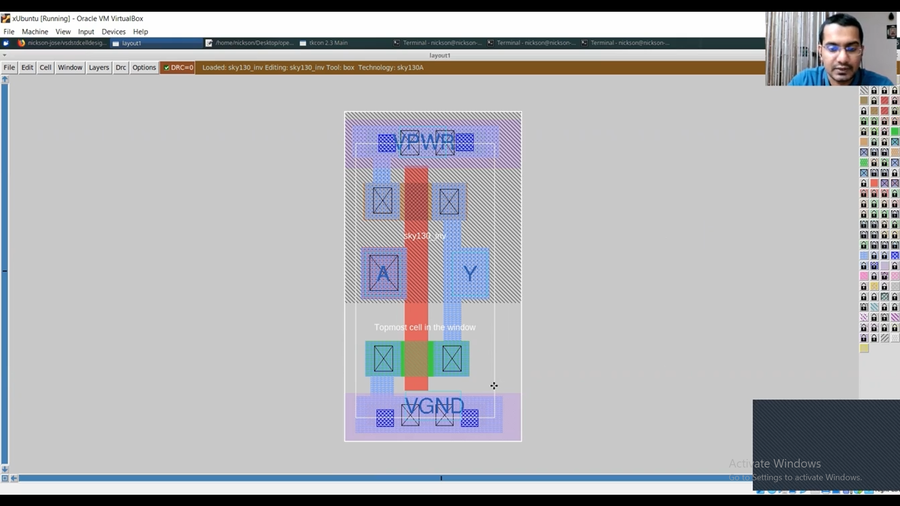
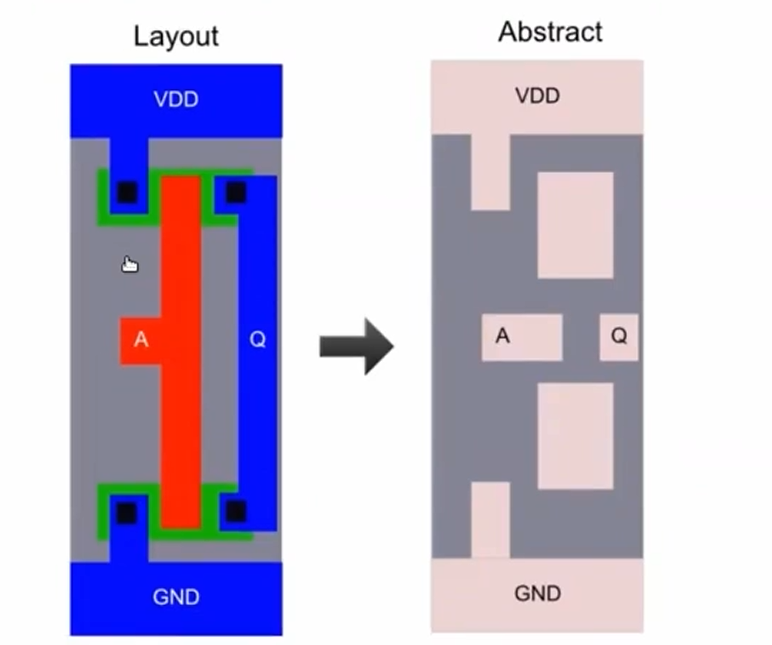
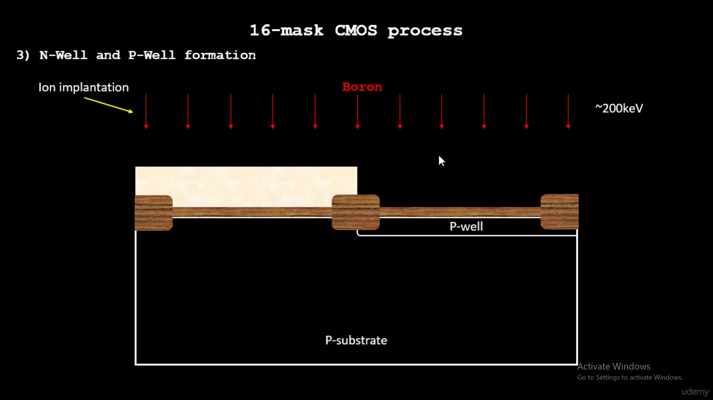
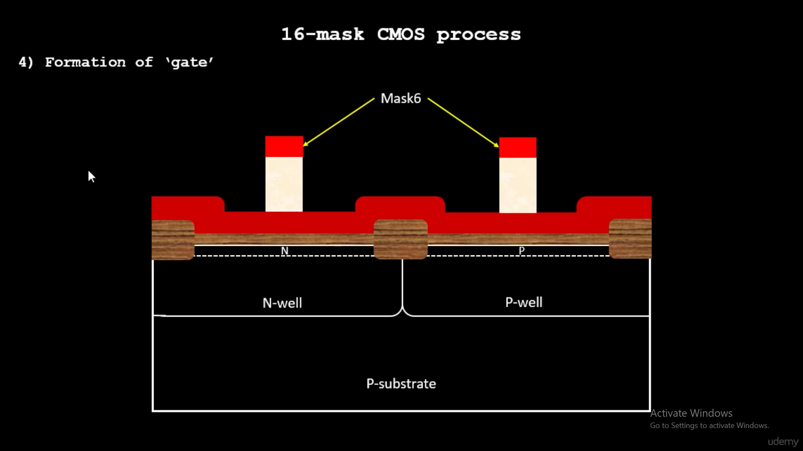
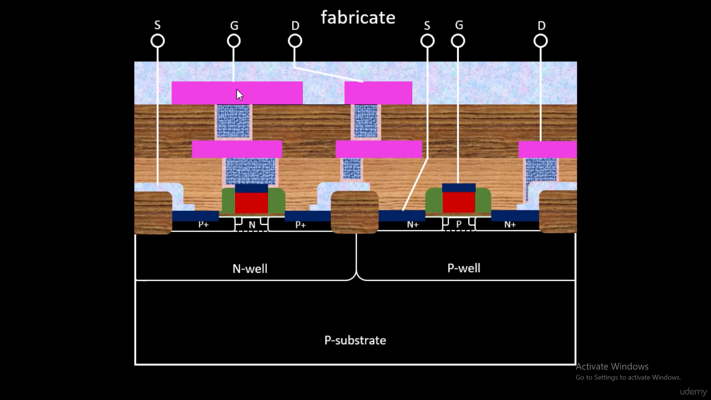
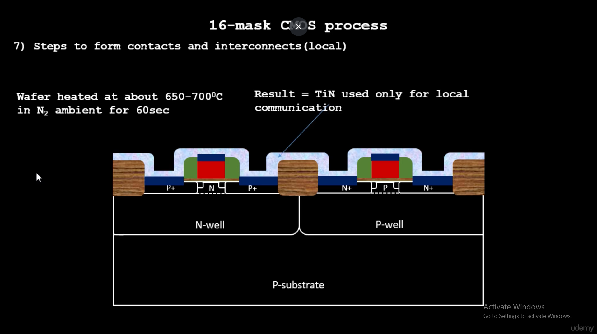
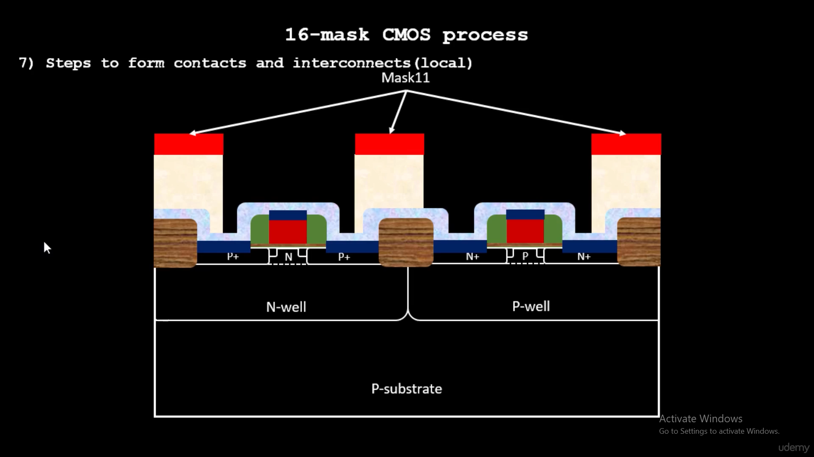
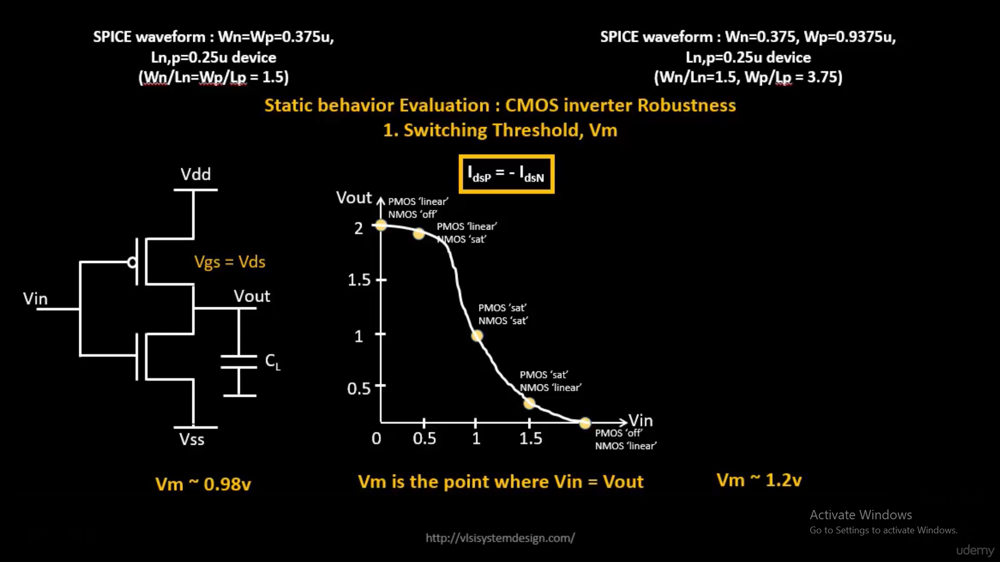

# Module 3 — Custom Standard Cell Design & Characterization

This module covers designing a **custom CMOS inverter standard cell from scratch**, characterizing it electrically with SPICE, and integrating it into the OpenLane flow alongside the `picorv32a` design.

The arc: **layout → DRC/connectivity verification → parasitic extraction → SPICE characterization → LEF generation → OpenLane integration**.

> Execution screenshots are linked, not embedded — click any link to open the image.

---

## 1. Setting Up

Cloned the custom cell design repo and copied in the sky130A Magic tech file needed to load the layout correctly.

```
git clone https://github.com/nickson-jose/vsdstdcelldesign.git
cp ~/Desktop/work/tools/openlane_working_dir/pdks/sky130A/libs.tech/magic/sky130A.tech .
```

📎 [clone_repo_and_copy_techfile.png](images/clone_repo_and_copy_techfile.png)

---

## 2. Layout vs. Abstract — Why a Cell Needs Both a Layout and a LEF

**Theory:** OpenLane's placer and router don't operate on full transistor-level geometry — they operate on an *abstract* view exposing only pins and a blockage shape. This abstraction is exactly what a LEF (Library Exchange Format) file encodes:



Each layer in the abstract corresponds to a real physical layer in the layout — N-well, poly, diffusion, contacts, metal1:



**Execution:** Opened the pre-built inverter layout (`sky130_inv.mag`) in Magic. It came up **DRC-clean** immediately, with all four ports visible: `A` (input), `Y` (output), `VPWR`, `VGND`.

```
magic -T sky130A.tech sky130_inv.mag &
```

📎 [inverter_layout.png](images/inverter_layout.png)

Verified transistor identities and connectivity directly in the layout using Magic's `what` command and node selection:

- **NMOS** confirmed at the poly/n-diffusion intersection — 📎 [verify_nmos.png](images/verify_nmos.png)
- **PMOS** confirmed at the poly/p-diffusion intersection — 📎 [verify_pmos.png](images/verify_pmos.png)
- **Output node (Y)** confirmed connected to both PMOS and NMOS drains — 📎 [verify_output_connectivity.png](images/verify_output_connectivity.png)
- **VPWR** confirmed connected to the PMOS source — 📎 [verify_vdd_connectivity.png](images/verify_vdd_connectivity.png)
- **VGND** confirmed connected to the NMOS source — 📎 [verify_gnd_connectivity.png](images/verify_gnd_connectivity.png)

This confirms the layout is a correctly wired, standard 2-transistor CMOS inverter before doing anything else with it.

---

## 3. Fabrication Background — What the Layout Physically Represents

**Theory:** A standard cell's layers correspond to real physical process steps in a 16-mask CMOS flow. N-well and P-well are formed by selective ion implantation (boron for P-well) followed by a high-temperature drive-in diffusion:



The gate stack (poly + gate oxide) is patterned next, defining where each transistor's channel forms:



After contacts, local interconnect, and higher-level metal are added, the final cross-section shows fully fabricated NMOS/PMOS transistors with labeled source/gate/drain terminals — this is the physical structure our `sky130_inv.mag` layout represents:



*(No separate execution step here — this is background for what the layout in Section 2 physically becomes on silicon.)*

---

## 4. Extraction to SPICE

**Theory:** The MOSFET threshold voltage `Vt` shifts with source-body voltage `Vsb`, governed by the body-effect coefficient γ. This is why body/well connections in a layout matter for accurate device modeling once parasitics are extracted:



**Execution:** Ran Magic's extractor to generate a `.ext` file capturing the netlist and parasitics, then converted it to a SPICE deck:

```
extract all
ext2spice cthresh 0 rthresh 0
ext2spice
```

📎 [extract_ext.png](images/extract_ext.png)
📎 [ext2spice_conversion.png](images/ext2spice_conversion.png)

The raw output (`sky130_inv.ext` → `sky130_inv.spice`) contained the transistor instances plus 6 parasitic capacitors extracted from the layout geometry.

📎 [spice_netlist_raw.png](images/spice_netlist_raw.png)

---

## 5. Debugging the SPICE Deck

**Theory:** A minimal CMOS inverter SPICE deck (model description + netlist) mirrors exactly what we needed to build for `sky130_inv` — just with generic PMOS/NMOS models instead of sky130-specific ones:



**Execution:** Getting the extracted netlist to actually simulate in ngspice took three real fixes:

**Bug 1 — Unknown subckt.** The raw netlist called `X0`/`X1` subcircuit instances referencing `sky130_fd_pr__nfet_01v8` / `sky130_fd_pr__pfet_01v8`. These names don't exist in this repo's model libraries — `libs/pshort.lib` and `libs/nshort.lib` instead define flat `.model` cards named `pshort_model.0..N` / `nshort_model.0..N` (corner variants).

📎 [libs_folder_listing.png](images/libs_folder_listing.png)
📎 [ngspice_error_unknown_subckt.png](images/ngspice_error_unknown_subckt.png)

Fix: changed the device lines from subcircuit calls (`X0`/`X1`) to plain MOSFET instances (`M0`/`M1`) referencing `nshort_model.0` / `pshort_model.0`.

**Bug 2 — Timestep too small.** The input pulse source `Va` was wired between node `A` and `VPWR` instead of ground, over-constraining the node. Fixed by referencing `Va` to ground: `Va A 0 pulse(...)`.

**Bug 3 — Still timestep too small.** `.option scale=10m` combined with `w=35 l=23` (extraction units) produced absurd 0.35m/0.23m-sized transistors instead of microns. Fixed to `.option scale=0.01u`, matching Magic's 0.010 micron grid.

The final working deck:

📎 [spice_netlist_edited_final.png](images/spice_netlist_edited_final.png)

---

## 6. Transient Simulation & Characterization

**Theory:** The inverter's Voltage Transfer Characteristic (VTC) — output voltage vs. input voltage — is the standard way to evaluate static CMOS inverter behavior. `Vm`, the switching threshold, is defined as the point where `Vin = Vout`, and depends on the relative strengths (W/L ratios) of the NMOS and PMOS:



*(Our own simulation ran a `.tran` pulse sweep rather than a DC sweep, so the result is a time-domain waveform — input pulse vs. output response — rather than a VTC curve directly. The underlying static-behavior concept is the same.)*

**Execution:** With all three SPICE bugs fixed, ngspice ran a clean transient simulation (`.tran 1n 20n`) with no convergence errors.

```
ngspice sky130_inv.spice
plot y vs time a
```

📎 [transient_waveform.png](images/transient_waveform.png)

The waveform confirms correct inverter behavior — `Y` cleanly inverts `A` with visible propagation delay on each transition.

Measured propagation delay and rise/fall times using `meas tran` (50% crossing for delay, 20%/80% for rise & fall):

```
meas tran prop_delay_fall TRIG v(a) VAL=1.65 RISE=1 TARG v(y) VAL=1.65 FALL=1
meas tran prop_delay_rise TRIG v(a) VAL=1.65 FALL=1 TARG v(y) VAL=1.65 RISE=1
meas tran rise_time TRIG v(y) VAL=0.66 RISE=1 TARG v(y) VAL=2.64 RISE=1
meas tran fall_time TRIG v(y) VAL=2.64 FALL=1 TARG v(y) VAL=0.66 FALL=1
```

📎 [characterization_results_full.png](images/characterization_results_full.png)

| Metric | Value |
|---|---|
| Fall propagation delay | ~1.76 ps* |
| Rise propagation delay | ~36.6 ps |
| Rise time (20%→80%) | ~36.0 ps |
| Fall time (80%→20%) | ~22.7 ps |

*\*The fall delay figure is unusually small compared to the others — most likely an artifact of the first (startup ringing) edge rather than a clean steady-state transition.*

---

## 7. Generating the LEF View

**Theory:** Covered in Section 2 above — the LEF is the abstract view a placer/router actually needs.

**Execution:** Generated a LEF view directly from Magic:

```
lef write
```

📎 [lef_generation.png](images/lef_generation.png)
📎 [lef_verified.png](images/lef_verified.png)

---

## 8. Integrating the Custom Cell into OpenLane (picorv32a)

**Execution:** The repo's `extras/guides.txt` documents the exact steps for adding an extra LEF into an OpenLane design.

📎 [extras_folder_listing.png](images/extras_folder_listing.png)
📎 [guides_readme.png](images/guides_readme.png)

**Step 1 — Copy files into the design's `src/` folder:**
```
cp sky130_inv.lef ../designs/picorv32a/src/
cp extras/picorv32a.synthesis.v ../designs/picorv32a/src/
cp extras/my_base.sdc ../designs/picorv32a/src/
```

**Step 2 — Add `EXTRA_LEFS` to `config.tcl`:**
```
set ::env(EXTRA_LEFS) [glob $::env(OPENLANE_ROOT)/designs/$::env(DESIGN_NAME)/src/*.lef]
```

📎 [config_tcl_before_edit.png](images/config_tcl_before_edit.png)

**Step 3 — Run the flow and load the LEF:**
```
docker run -it -v $(pwd):/openLANE_flow -v $PDK_ROOT:$PDK_ROOT -e PDK_ROOT=$PDK_ROOT \
  -u $(id -u $USER):$(id -g $USER) efabless/openlane:v0.21

./flow.tcl -interactive
package require openlane
prep -design picorv32a

set lefs [glob $::env(DESIGN_DIR)/src/*.lef]
add_lefs -src $lefs
run_synthesis
```

Synthesis completed successfully.

**Step 4 — Confirm the custom cell was actually loaded into the flow's physical library:**

```
grep -i sky130_inv designs/picorv32a/runs/<run_folder>/tmp/merged.lef
```

```
MACRO sky130_inv
  FOREIGN sky130_inv ;
END sky130_inv
MACRO sky130_inv
  FOREIGN sky130_inv ;
END sky130_inv
```

This confirms `sky130_inv` is registered as a physical MACRO in OpenLane's merged LEF.

> **Note on scope:** `sky130_inv` does *not* appear in the synthesized netlist itself. That's expected — logic synthesis (Yosys/ABC) only selects cells based on a **Liberty (.lib)** timing file, which was never generated for this custom cell. A LEF only gives the placer/router physical awareness of the cell's footprint; it doesn't influence which cells synthesis chooses. Confirming the LEF loads cleanly into the flow — without errors — is the actual goal of this integration step.

---

## Output Files

| File | Description |
|---|---|
| `output_files/sky130_inv.mag` | Magic layout of the custom inverter |
| `output_files/sky130_inv.ext` | Extracted netlist (post-`extract all`) |
| `output_files/sky130_inv.spice` | Final, working SPICE deck used for characterization |
| `output_files/sky130_inv.lef` | Generated LEF view, used in the OpenLane flow |

---

## Summary

| Stage | Result |
|---|---|
| Layout | DRC clean, correctly wired CMOS inverter |
| Extraction | Clean `.ext` → `.spice` conversion |
| SPICE simulation | 3 bugs found & fixed (model names, source reference, scale factor) |
| Characterization | Rise delay ~36.6ps, fall time ~22.7ps, rise time ~36.0ps |
| LEF generation | Successful, verified on disk |
| OpenLane integration | Synthesis successful, custom cell confirmed merged as a physical MACRO |
