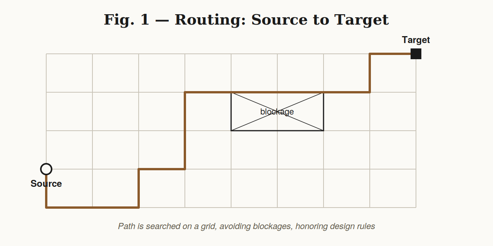
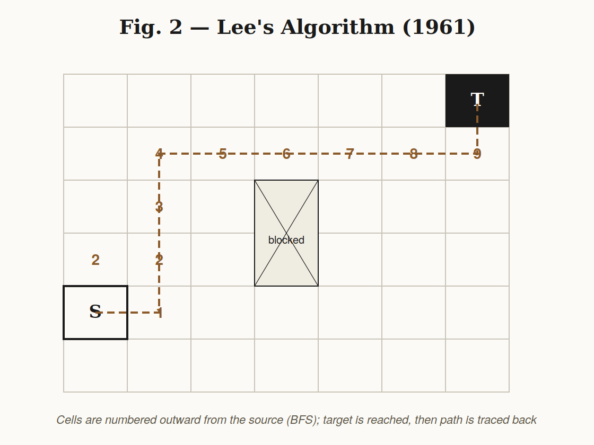
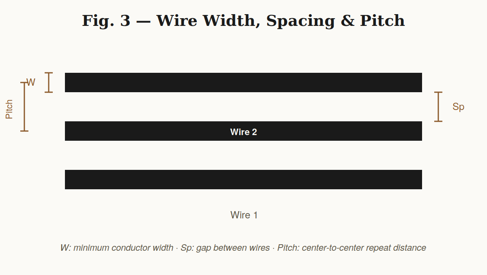
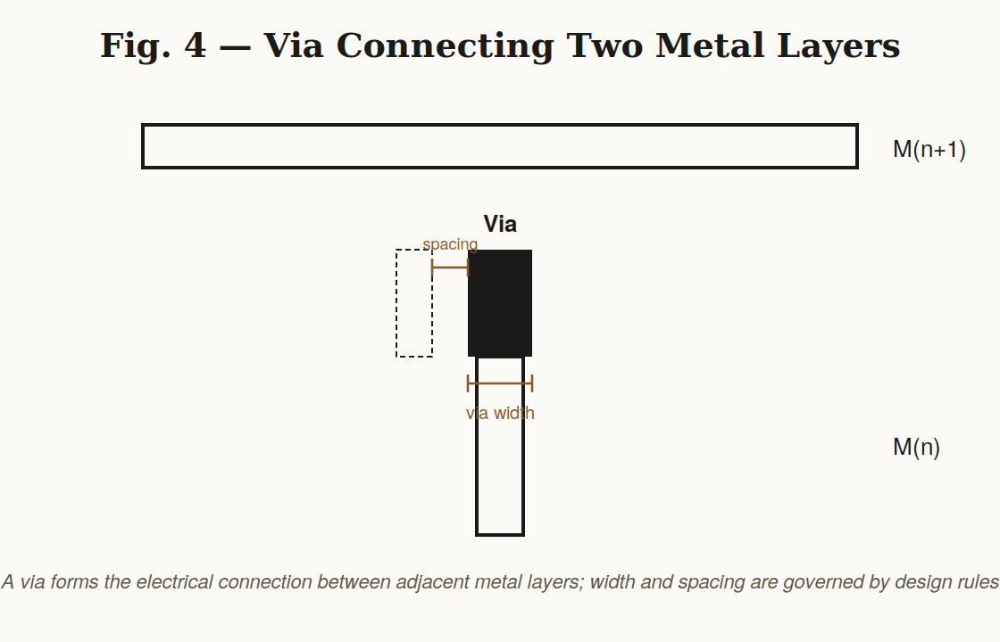
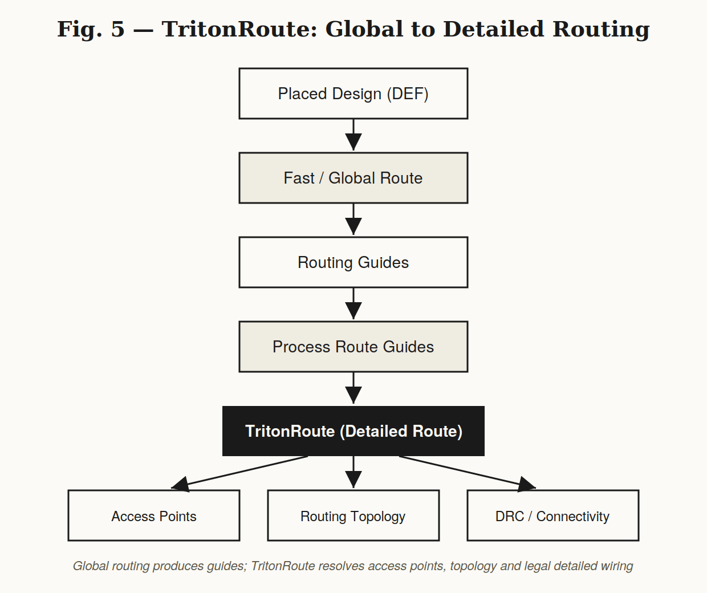
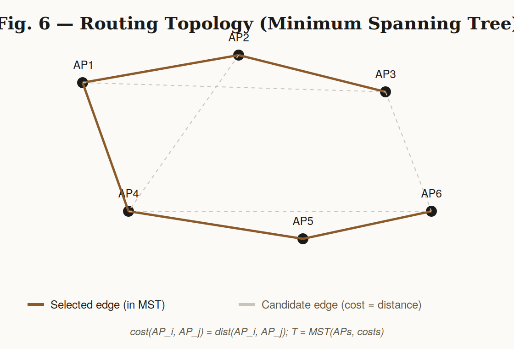

# Module 5 – Final Steps for RTL to GDS Using TritonRoute and OpenSTA

## Overview

This module covers the final stages of the RTL-to-GDS physical design flow: **routing** (global + detailed, via TritonRoute) and **post-route static timing analysis** (via OpenSTA).

---

## 1. Routing

Routing establishes a physical connection between a **source** and a **target** point while satisfying routing constraints and design rules.



## 2. Maze Routing — Lee's Algorithm (1961)

Lee's algorithm is a grid-based search technique: starting from the source, adjacent grid boxes are numbered outward (a wavefront) until the target is reached, then the path is traced back from target to source, avoiding placement blockages along the way.



## 3. Design Rule Check (DRC) — Wire Rules

Three key wire-level design rules must be satisfied:

| Rule | Description |
|---|---|
| Wire Width | Minimum conductor width allowed by the technology |
| Wire Pitch | Center-to-center repeat distance of parallel wires |
| Wire Spacing | Minimum gap between two wires (violating this risks a signal short) |



## 4. Vias and Metal Layers

A **via** connects two adjacent metal layers (M(n) ↔ M(n+1)) and must satisfy minimum **via width** and **via spacing** rules to avoid signal shorts.



## 5. Routing Commands

```tcl
# Check the current DEF
echo $::env(CURRENT_DEF)

# Generate the power distribution network
gen_pdn

# Run the routing stage
run_routing
```

## 6. Routing Using TritonRoute

Routing with TritonRoute happens in two stages:

- **Fast Route / Global Route** – produces an initial solution and routing guides
- **Detailed Route** – TritonRoute consumes processed route guides and produces the actual physical wires and vias

TritonRoute honors route guides, connectivity constraints, and design rules; it uses an MLP-based panel routing approach with **intra-layer parallel routing** and **inter-layer sequential routing**.



**Inputs:** LEF, DEF, Processed Route Guides
**Output:** Detailed routing solution with optimized wire length and via count

### Inter-Guide Connectivity

Two routing guides are connected when:
- they are on the **same metal layer** with touching edges, **or**
- they are on **neighboring metal layers** with a non-zero vertical overlap

### Access Points (APs)

An Access Point is a grid point on a metal layer used to connect lower-layer segments, upper-layer segments, pins, and I/O ports.

## 7. Routing Topology Optimization

Routing topology is optimized using a **Minimum Spanning Tree (MST)** over the access points:

```
for i = 1 to n-1:
    for j = i+1 to n:
        cost_ij <- dist(AP_i, AP_j)
T <- MST(APs, costs)
return e_ij in T
```



## 8. Post-Route Verification

After detailed routing, the design is checked for:
- DRC violations (wire width / pitch / spacing, via width / spacing)
- Signal shorts
- Connectivity / routing completeness

## 9. OpenSTA — Static Timing Analysis

OpenSTA verifies the timing behavior of the implemented design without exhaustive functional simulation:

- **Setup timing** – data must arrive sufficiently before the active clock edge
- **Hold timing** – data must remain stable for the required time after the active clock edge
- **Slack** = Required Time − Arrival Time
  - Positive slack → timing met
  - Negative slack → timing violation
- Clock path analysis (arrival time, delay, skew) and data path analysis (arrival time, required time, path delay)

## 10. Complete RTL-to-GDS Flow

```
RTL → Synthesis → Floorplanning → Placement → Clock Tree Synthesis
   → Fast/Global Routing → Routing Guides → Detailed Routing (TritonRoute)
   → DRC / Connectivity Verification → Static Timing Analysis (OpenSTA)
   → Final Verification → GDSII
```

---

## Execution Screenshots

> Drop real run screenshots into `images/`, numbered in execution order, and link them below.

- [01 — Current DEF check](images/01_current_def_check.png)
- [02 — gen_pdn output](images/02_gen_pdn.png)
- [03 — run_routing output](images/03_run_routing.png)
- [04 — DRC report](images/04_drc_report.png)
- [05 — OpenSTA timing report](images/05_opensta_report.png)

## Output Files

> Drop generated LEF / DEF / Verilog / reports into `output_files/`.

- `output_files/` — routed DEF, DRC report, OpenSTA timing report, etc.

---

## Key Concepts Glossary

| Term | Definition |
|---|---|
| Routing | Establishes physical connections between source and target points |
| Maze Routing | Grid-based search technique for finding a valid routing path |
| Lee's Algorithm | Classical 1961 grid-based maze-routing algorithm |
| DRC | Checks whether the physical layout follows required design rules |
| TritonRoute | Performs detailed routing using processed routing guides |
| Routing Guide | Provides routing information that guides detailed routing |
| Access Point | A valid grid point for establishing a routing connection |
| Routing Topology | The structure connecting all required access points |
| OpenSTA | Performs static timing analysis on the implemented design |

---

*Diagrams in `theory_images/` are original illustrations created for this module, not reproductions of any third-party source.*
