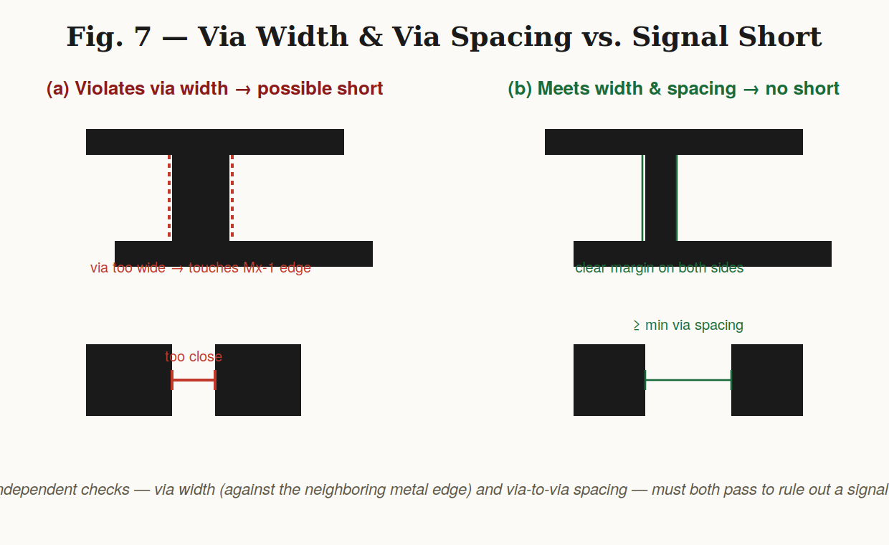
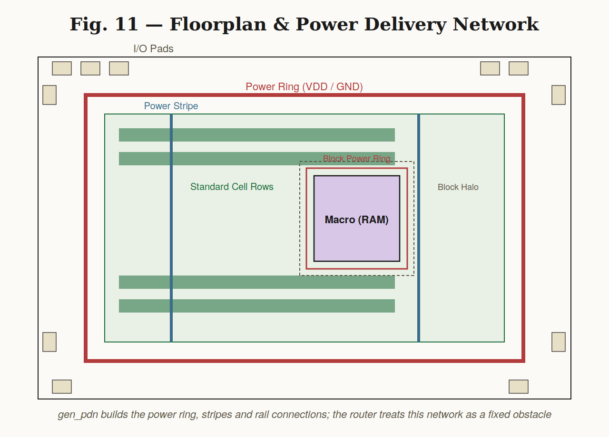
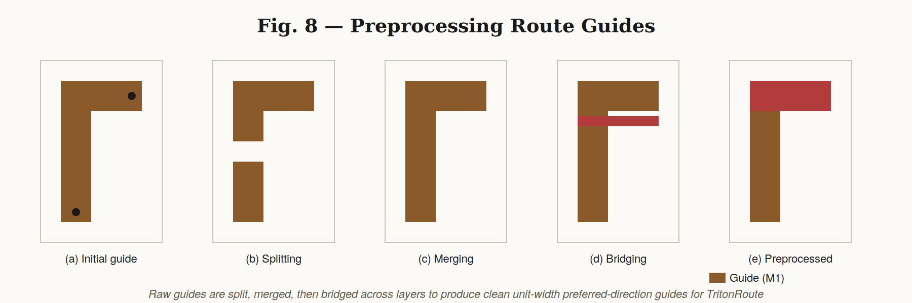
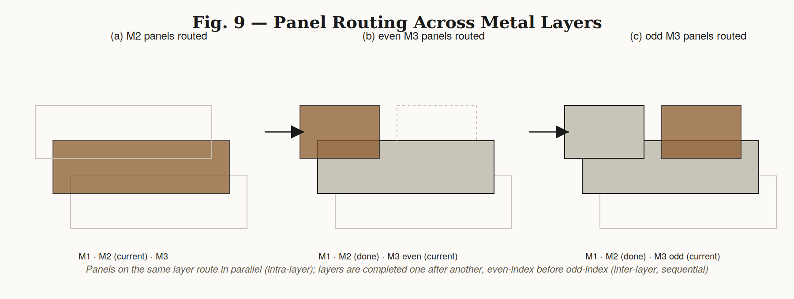
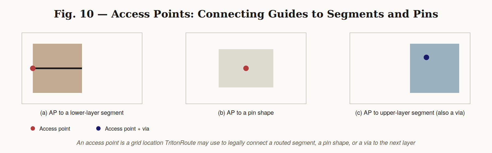

# Module 5 – Final Steps for RTL to GDS Using TritonRoute and OpenSTA

## Overview

This module covers the final stages of the RTL-to-GDS physical design flow: **routing** (global + detailed, via TritonRoute) and **post-route static timing analysis** (via OpenSTA). Since the execution run for this module hasn't been completed yet, this README focuses on building a thorough theoretical foundation — the algorithms, design rules, and flow mechanics behind each stage — so the concepts are solid ahead of execution.

---

## 1. Routing

Routing is the stage that establishes a physical connection between a **source** and a **target** point on the chip, while satisfying:
- Routing constraints (route guides, preferred direction, connectivity)
- Design rules (width, spacing, pitch — see Section 3)

It comes right after placement and clock tree synthesis, once every standard cell and macro has a fixed (x, y) location, and before the design can be checked and taped out.


## 2. Maze Routing — Lee's Algorithm (1961)

Maze routing treats the routing area as a grid and searches it for a valid path between source and target, avoiding obstacles (placement blockages, existing wires, blocked cells).

**Lee's Algorithm** is the classical grid-based maze router, published in 1961. It works in two phases:

**Phase 1 — Wave expansion (BFS):**
1. Start from the source cell; label it 0.
2. Examine every unlabeled, unblocked adjacent cell; label each with the current label + 1.
3. Repeat outward, layer by layer (like ripples from a stone dropped in water), skipping blocked cells entirely.
4. Stop as soon as the target cell is reached and labeled.

**Phase 2 — Backtrace:**
5. Starting at the target, move to any neighboring cell whose label is exactly one less than the current cell's label.
6. Repeat until the source (label 0) is reached — this reconstructs the shortest legal path.

Because it's a breadth-first search, Lee's algorithm is **guaranteed to find the shortest path** if one exists, but its memory and runtime cost grow with the grid size, which is why modern detailed routers (like TritonRoute) use it only as a conceptual/local building block rather than the whole-chip strategy.


## 3. Design Rule Check (DRC) — Wire Rules

DRC verifies that the physical layout obeys the geometric rules of the target technology node. For wires specifically, three rules matter most:

| Rule | Description | Consequence if violated |
|---|---|---|
| **Wire Width** | Minimum conductor width the technology allows | Resistance too high / manufacturing failure |
| **Wire Pitch** | Center-to-center repeat distance of parallel wires (≈ width + spacing) | Wires won't align to the routing grid |
| **Wire Spacing** | Minimum gap between two adjacent wires | Risk of a signal short between nets |


## 4. Vias and Metal Layers

A chip's interconnect is built from stacked **metal layers** (M1, M2, M3, ... Mn), each typically routed in a single preferred direction (alternating horizontal/vertical) to simplify routing and reduce shorts. A **via** is the vertical connection that lets a net move from one metal layer to the next.

Two via-level rules matter for correctness:

- **Via Width** — the via itself must meet a minimum size; if too large it can touch a neighboring wire on the same or adjacent layer.
- **Via Spacing** — the distance between two separate vias must meet a minimum, or their fields of influence can effectively short two nets together.


Both checks exist for the same underlying reason — **preventing an unintended electrical connection (a signal short)** — but they guard against it from two different geometric angles: via-to-wire and via-to-via.



## 5. Signal Shorts

A **signal short** happens when two nets that should stay electrically isolated end up unintentionally connected. Common causes:
- Insufficient wire spacing
- Incorrect routing topology
- Improper layer usage
- Incorrect via placement
- Overlapping wires

**Prevention** generally comes down to: honoring spacing/width/pitch rules strictly, following the routing guides rather than routing arbitrarily, and — when a layer is too congested to route safely — pushing the connection to a different metal layer via an additional via.

## 6. Routing Commands (OpenROAD-style flow)

```tcl
# Check the current DEF (design exchange format) before routing
echo $::env(CURRENT_DEF)

# Generate the power distribution network (power rings, stripes, rails)
gen_pdn

# Run the routing stage (global + detailed route)
run_routing
```

`gen_pdn` builds the power delivery network shown below — power ring, power stripes, and standard-cell rail connections — which the router must route *around* as a fixed obstacle.



## 7. Routing Using TritonRoute

TritonRoute performs the **detailed routing** stage of the flow, after global routing has produced an initial topology.

**Two-stage split:**
- **Fast Route / Global Route** — coarse-grained; divides the chip into a grid of global cells (GCells) connected by global edges, and finds an approximate routing solution and a set of *routing guides* per net, without worrying about exact track-level geometry yet.
- **Detailed Route (TritonRoute)** — takes those guides and produces exact, DRC-clean wires and vias on real routing tracks.

**Problem statement:** given LEF (technology + cell geometry), DEF (placed design), and processed route guides, produce a detailed routing solution that connects every net legally while minimizing wire length and via count.

**Inputs:** LEF, DEF, Processed Route Guides
**Output:** Detailed routing — physical wires and vias — with optimized wire length and via count

**Main functions:**
- Performs unit detailed routing per net
- Honors the *processed* route guides produced after global routing (not the raw ones — see Section 8)
- Assumes route guides already satisfy inter-guide connectivity and design rules, so it can trust and build on them rather than re-deriving topology from scratch
- Uses an **MLP-based panel routing approach** — the routing area is sliced into panels, and routing decisions inside a panel are made together
- Performs **intra-layer parallel routing** (panels on the same metal layer are routed simultaneously) and **inter-layer sequential routing** (layers are completed one at a time, in order)


## 8. Processed Route Guides

Raw guides coming out of global routing aren't immediately usable by the detailed router — they need to be cleaned up first. The processed guides must:
- Have unit width
- Be aligned to the preferred routing direction of their layer
- Carry the routing information TritonRoute needs (which net, which layer, connectivity to pins)
- Already satisfy basic routing constraints

**Preprocessing pipeline:**
1. **Splitting** — break an oversized or oddly-shaped initial guide into smaller unit-aligned pieces
2. **Merging** — combine adjacent split pieces back into efficient straight segments where possible
3. **Bridging** — add a short connecting guide across layers so pieces on M1 and M2 remain linked
4. **Preprocessed guides** — the final, clean guide set TritonRoute consumes



## 9. Panel Routing (Intra-Layer Parallel / Inter-Layer Sequential)

TritonRoute's MLP-based approach divides each metal layer into **panels** — strips of the routing area — and routes them in a specific order to balance speed and correctness:

(a) Panels on M2 are routed in parallel (no ordering dependency between panels on the same layer).
(b) Once M2 is done, **even-indexed** panels on M3 route in parallel.
(c) Then **odd-indexed** panels on M3 route in parallel, using the even panels as fixed context.

This alternating even/odd scheme lets neighboring panels on the same layer be routed simultaneously without stepping on each other's decisions, while still resolving layer-to-layer dependencies sequentially.



## 10. Inter-Guide Connectivity

Two routing guides are considered connected when:
- They are on the **same metal layer** with touching edges, **or**
- They are on **neighboring metal layers** with a non-zero vertical overlap area

This is what lets the router treat a chain of guide segments — possibly spanning several layers — as one continuous, connectable path for a net.


## 11. Access Points (APs)

An **Access Point** is a specific grid location on a metal layer that the router is allowed to use to make a legal connection. Access points let TritonRoute attach a routed segment to:
- A **lower-layer segment** — connecting down to an already-routed wire below
- A **pin shape** — connecting directly to a standard cell or macro pin
- An **upper-layer segment**, which is also, implicitly, a via location — connecting up to the next metal layer



The router selects among candidate access points while weighing connectivity, which metal layer is involved, preferred routing direction, via availability, and design rules — not just picking the nearest legal point.

## 12. Routing Topology Optimization

Once access points are known for every pin of a net, TritonRoute needs a **topology** — the tree structure connecting them all — before it can lay down actual wires. This topology is optimized as a **Minimum Spanning Tree (MST)** problem over the access points:

```
Algorithm: Optimization of Routing Topology
for i = 1 to n-1:
    for j = i+1 to n:
        cost_ij <- dist(AP_i, AP_j)
T <- MST(APs, costs)
return e_ij in T
```

- `AP_i`, `AP_j` — two access points belonging to the same net
- `cost_ij` — the cost of connecting them, taken as their physical distance
- `T` — the resulting minimum spanning tree, i.e. the routing topology that connects every AP using the least total wire

Building the full cost matrix this way is **O(n²)** in the number of access points for a net, and any standard MST algorithm (Prim's or Kruskal's) can then extract the tree in roughly O(n² log n) or O(E log n) time. The MST is a good fit here because it minimizes total wirelength while guaranteeing every access point is reachable, without introducing redundant loops.

The topology should:
- Connect all required access points
- Maintain full connectivity for the net
- Follow the routing guides
- Avoid blockages
- Satisfy design rules
- Minimize unnecessary routing resources (wirelength, via count)


## 13. Post-Route Verification

After detailed routing finishes, the full design is checked for:
- **DRC violations** — wire width, wire pitch, wire spacing, via width, via spacing
- **Signal shorts**
- **Connectivity / routing completeness** — every net fully connected, no open nets

Only a design that is both DRC-clean and fully connected is allowed to proceed to timing signoff.

## 14. OpenSTA — Static Timing Analysis

OpenSTA verifies the timing behavior of the implemented design **without** running exhaustive functional simulation — it walks every timing path through the netlist algebraically instead.

**Setup timing** — checks that data reaches the receiving flip-flop's D input sufficiently *before* the active clock edge, so the value is stable in time to be captured. A **setup violation** means the combinational logic between two flops is too slow relative to the clock period.

**Hold timing** — checks that data at the D input remains stable for a required minimum time *after* the active clock edge, so the old value isn't accidentally overwritten before it's captured. A **hold violation** means data is arriving too fast relative to the clock, and is independent of clock frequency (it can't be fixed by slowing the clock down — it needs delay added to the data path).

**Slack** is the timing margin of a path:

```
Slack = Required Time − Arrival Time
```

- **Positive slack** → the path meets its timing requirement, with margin to spare
- **Negative slack** → a timing violation on that path; it needs to be fixed (buffer sizing, logic restructuring, or a faster/slower clock)

**Clock path analysis** considers clock arrival time, clock delay, clock skew, and both the setup and hold requirements at the destination flop.

**Data path analysis** considers data arrival time, required arrival time, path delay, setup timing, hold timing, and the resulting slack — this is what's actually reported per path in a timing report.

## 15. Post-Route Verification Checklist

After detailed routing and before signoff, the design must be checked for:

| Check | What it verifies |
|---|---|
| Connectivity | Every net is fully and correctly connected |
| DRC violations | Width / spacing / pitch rules for wires and vias |
| Signal shorts | No unintended net-to-net connections |
| Wire spacing | Minimum spacing maintained everywhere |
| Wire width | Minimum width maintained everywhere |
| Via spacing / width | Vias meet minimum geometric rules |
| Routing completeness | No open (unrouted) nets remain |
| Timing violations | No unresolved setup/hold violations from OpenSTA |

## 16. Complete RTL-to-GDS Flow

```
RTL → Synthesis → Floorplanning → Placement → Clock Tree Synthesis
   → Fast/Global Routing → Routing Guides → Detailed Routing (TritonRoute)
   → DRC / Connectivity Verification → Static Timing Analysis (OpenSTA)
   → Final Verification → GDSII
```

---

## Execution Screenshots

> Not yet completed for this module — theory has been covered in depth above ahead of the execution run. Once run, drop real screenshots into `images/`, numbered in execution order, and link them below.

- [ ] 01 — Current DEF check
- [ ] 02 — `gen_pdn` output
- [ ] 03 — `run_routing` output
- [ ] 04 — DRC report
- [ ] 05 — OpenSTA timing report

## Output Files

> Not yet generated. Once the run is complete, drop LEF / DEF / Verilog / reports into `output_files/`.

- `output_files/` — routed DEF, DRC report, OpenSTA timing report, etc.

---

## Key Concepts Glossary

| Term | Definition |
|---|---|
| Routing | Establishes physical connections between source and target points |
| Maze Routing | Grid-based search technique for finding a valid routing path |
| Lee's Algorithm | Classical 1961 BFS-based grid maze-routing algorithm |
| DRC | Checks whether the physical layout follows required design rules |
| Signal Short | An unintended electrical connection between two nets |
| TritonRoute | Performs detailed routing using processed routing guides |
| Routing Guide | Provides routing information that guides detailed routing |
| Preprocessing (guides) | Splitting, merging, and bridging raw guides into a usable form |
| Panel Routing | Dividing a layer into panels routed in parallel/sequential order |
| Inter-Guide Connectivity | Rule for when two guides count as connected |
| Access Point | A valid grid point for establishing a routing connection |
| Routing Topology | The structure (tree) connecting the required access points |
| MST | Minimum Spanning Tree — used to optimize routing topology |
| Setup Timing | Data must arrive before the active clock edge |
| Hold Timing | Data must remain stable after the active clock edge |
| Slack | Required Time − Arrival Time; margin on a timing path |
| OpenSTA | Performs static timing analysis on the implemented design |

---

*Diagrams in `theory_images/` are original illustrations created for this module to explain the concepts above, not reproductions of any third-party source.*
