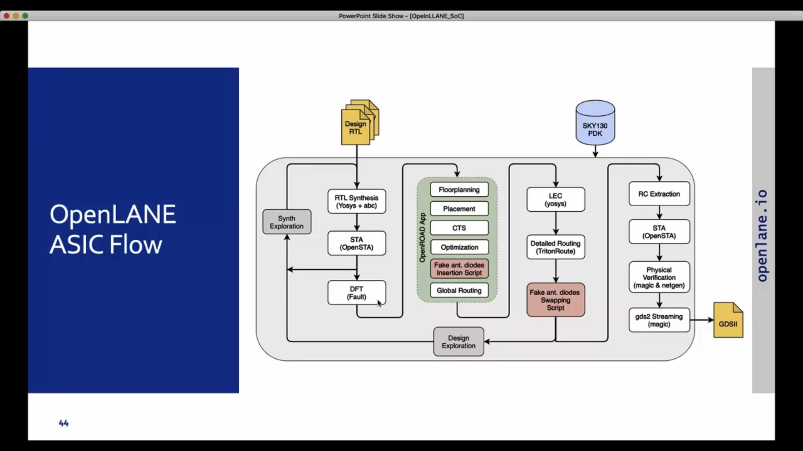
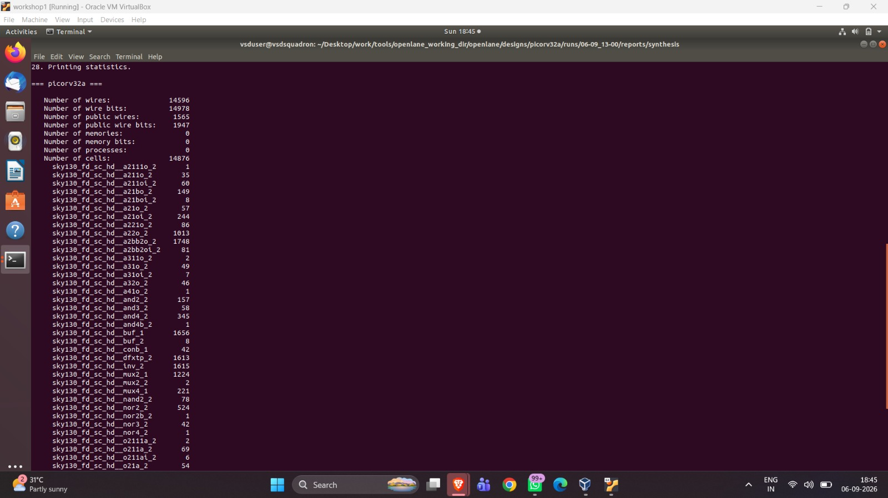
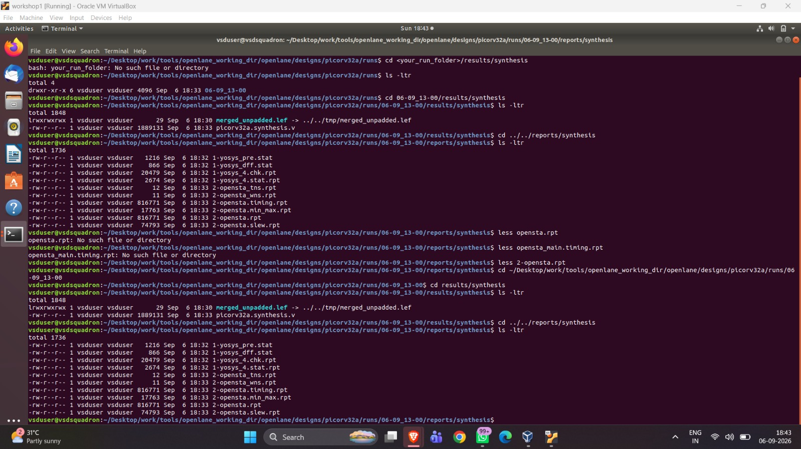
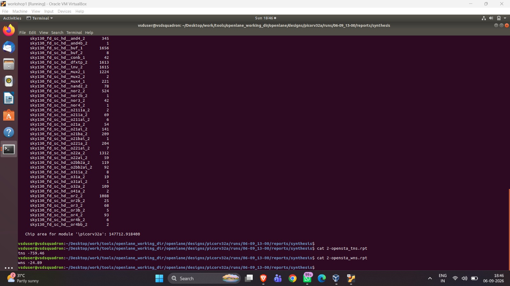

# Week 3 – RTL-to-GDSII Flow using OpenLane and SKY130

This week moves beyond standalone RTL simulation into a full **ASIC implementation flow** — taking a real RISC-V core (`picorv32a`) through OpenLane, an open-source automated flow that stitches together Yosys, ABC, OpenSTA, OpenROAD, TritonRoute, Magic and Netgen into a single RTL-to-GDSII pipeline built on the SkyWater SKY130 open-source PDK.

<p align="center">
  
</p>

The diagram above is the flow this week is built around: RTL and the SKY130 PDK go in on the left, and a manufacturable GDSII comes out on the right, passing through synthesis, floorplanning, placement, CTS, routing, extraction and physical verification along the way. This week's work covers the **first stage of that pipeline — RTL Synthesis** — with later modules picking up floorplanning, placement, CTS and routing as they're completed.

```text
Design RTL  ──►  RTL Synthesis (Yosys + abc)  ──►  STA (OpenSTA)  ──►  ...  ──►  GDSII
                          ▲
                    Module 1 (this folder)
```

---

## Module 1 — RTL Synthesis (`picorv32a`)

**Goal:** take the `picorv32a` RISC-V core through OpenLane's synthesis stage, producing a gate-level netlist mapped onto SKY130 standard cells, and check its post-synthesis timing.

### 1. Bringing up OpenLane and prepping the design

Launched OpenLane in interactive mode from the workshop's Docker container and prepped the design, which merges the SKY130 LEF files and builds the run's config:

```tcl
./flow.tcl -interactive
package require openlane 0.9
prep -design picorv32a
```

`prep` pulls in the SKY130 PDK, merges the standard-cell and macro LEFs (`sky130_fd_sc_hd.lef`, fill cells, decap cells, fakediode cells), and creates a fresh timestamped run directory (`runs/06-09_13-00/`) where every subsequent report and output for this run gets written.

<p align="center">
  
</p>

### 2. Running synthesis

```tcl
run_synthesis
```

This single command drives Yosys through RTL elaboration, generic synthesis, and ABC-based technology mapping onto the `sky130_fd_sc_hd` library, followed immediately by an OpenSTA timing check on the freshly mapped netlist.

### 3. Reading the synthesis statistics

Once synthesis finished, Yosys printed the final cell-level breakdown for the design:

<p align="center">
  
</p>

| Metric | Value |
|---|---|
| Number of wires | 14,596 |
| Number of wire bits | 14,978 |
| Number of public wires | 1,565 |
| Number of cells | 14,876 |
| Flip-flops (`dfxtp_2`) | 1,613 |
| Chip area | 147,712.92 (library units) |

The cell list spans the full `sky130_fd_sc_hd` gate set actually used to implement the design — AND/OR/NAND/NOR variants, AOI/OAI compound gates, muxes (`mux2_1`, `mux4_1`), buffers, inverters and the D-flip-flops that hold the core's register state.

### 4. Locating the reports on disk

OpenLane timestamps every run, so before pulling any file out I had to confirm the actual run folder and report filenames — this OpenLane version prefixes synthesis reports with a step number (`2-opensta...`) rather than a plain `opensta.rpt`:

<p align="center">
  
</p>

```bash
cd designs/picorv32a/runs/06-09_13-00/reports/synthesis
ls -ltr
```

```text
2-opensta.rpt
2-opensta.timing.rpt
2-opensta.min_max.rpt
2-opensta.slew.rpt
2-opensta_tns.rpt
2-opensta_wns.rpt
```

### 5. Post-synthesis timing (TNS / WNS)

```bash
cat 2-opensta_tns.rpt
cat 2-opensta_wns.rpt
```

<p align="center">
  
</p>

| Metric | Value | Meaning |
|---|---|---|
| **TNS** (Total Negative Slack) | `-759.46` | Sum of negative slack across every violating path |
| **WNS** (Worst Negative Slack) | `-24.89` | The single worst timing violation on the critical path |

Both values being negative at this stage is expected — synthesis-stage STA runs on an un-placed, un-buffered netlist with ideal wire assumptions, so timing violations here get progressively cleaned up in later stages (placement optimization, CTS, and post-route STA with real parasitics). This is the number I'll be watching to see improve as the design moves through the rest of the flow.

### 6. Output files

| File | Description |
|---|---|
| [`synthesis_files/picorv32a.synthesis.v`](./Module1/synthesis_files/picorv32a.synthesis.v) | Gate-level netlist mapped to `sky130_fd_sc_hd`, produced by `run_synthesis` |
| [`synthesis_files/2-opensta.rpt`](./Module1/synthesis_files/2-opensta.rpt) | Full OpenSTA report for the synthesized netlist |
| [`synthesis_files/2-opensta.timing.rpt`](./Module1/synthesis_files/2-opensta.timing.rpt) | Detailed path-by-path timing report from OpenSTA |

---

## Key Takeaways from Module 1

- OpenLane wraps the individual open-source tools (Yosys, ABC, OpenSTA) behind a small set of interactive commands (`prep`, `run_synthesis`), but every stage still produces the same kind of raw reports and netlists you'd get running the tools by hand — OpenLane just sequences and configures them consistently.
- Every OpenLane run is timestamped and self-contained under `runs/<timestamp>/`, with `results/` holding generated artifacts (netlists, layouts) and `reports/` holding the analysis output (timing, stats, checks) for that specific run.
- A negative TNS/WNS right after synthesis isn't a failure — it reflects that timing hasn't been closed yet, since placement, CTS and routing haven't happened. It's a baseline to compare against once the design moves further through the flow.
- The `sky130_fd_sc_hd` cell counts in the synthesis stats are a direct, practical view of how RTL constructs like the ALU, register file, and instruction decoder in `picorv32a` actually get realized in silicon-mappable logic.

---

## What's Next

Module 2 continues the flow from this synthesized netlist — floorplanning and placement onto the SKY130 core area — and will be added to this folder once complete.

```text
Module 1 (done)          Module 2 (in progress)
RTL → Synthesis    ──►    Floorplanning → Placement    ──►  ...
```

---

**Contributor / Git Blame:**

| File | Author |
|---|---|
| All files in this folder | `Rakshith304` |
