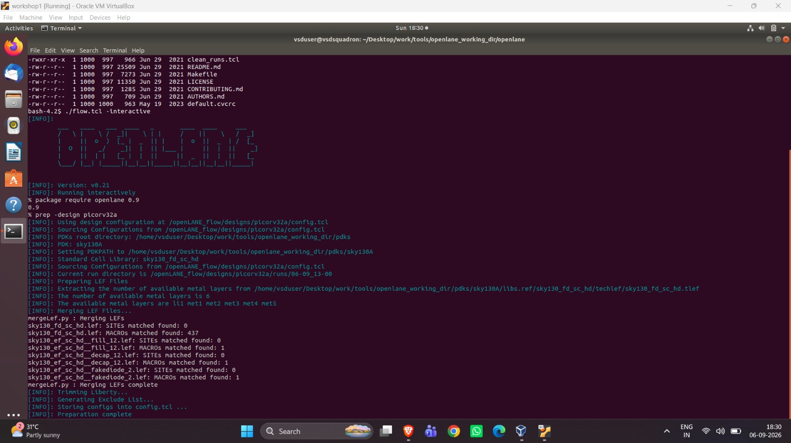
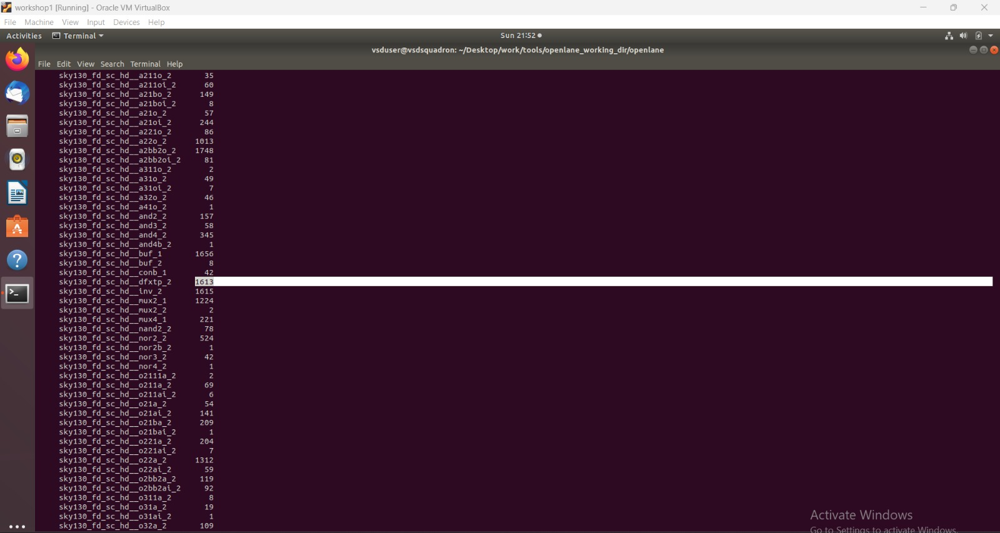
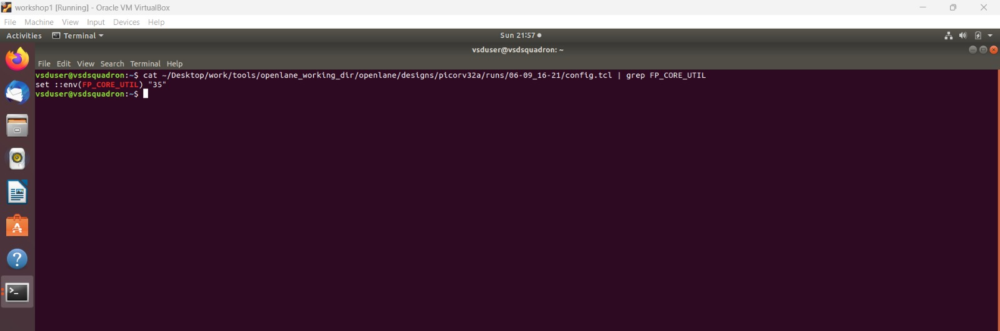
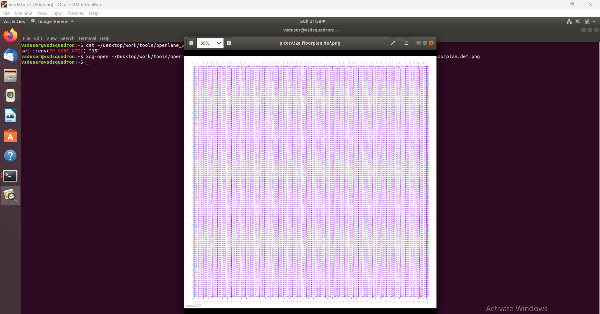
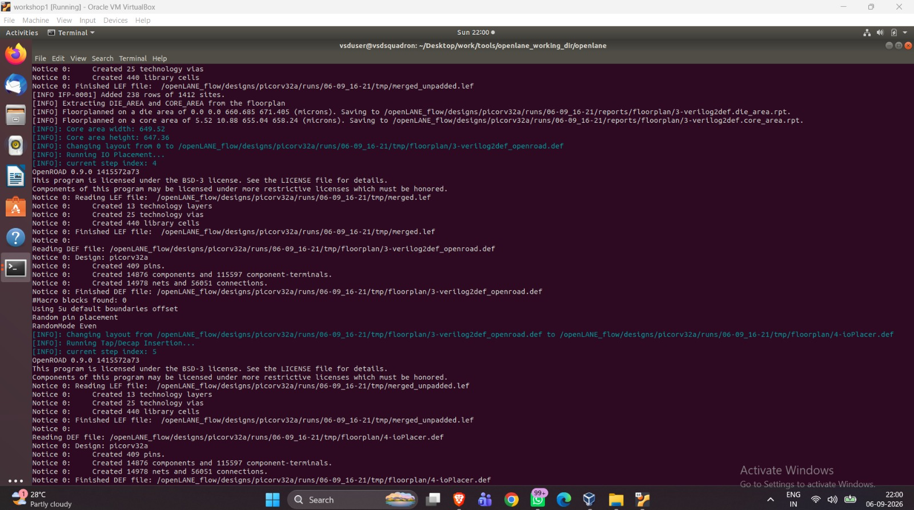
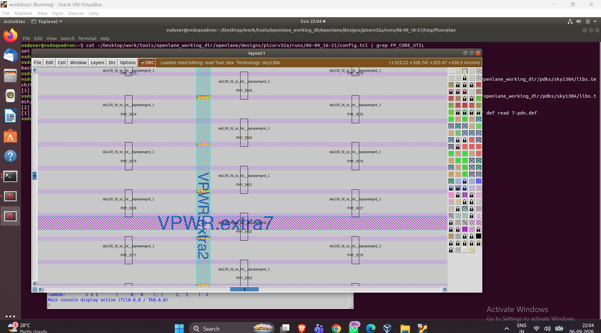
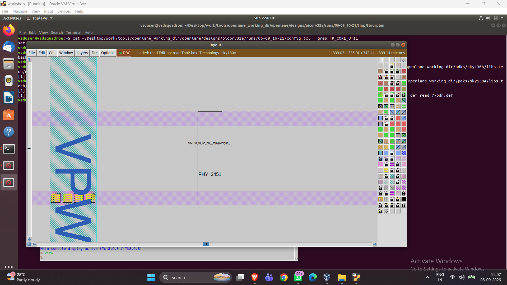
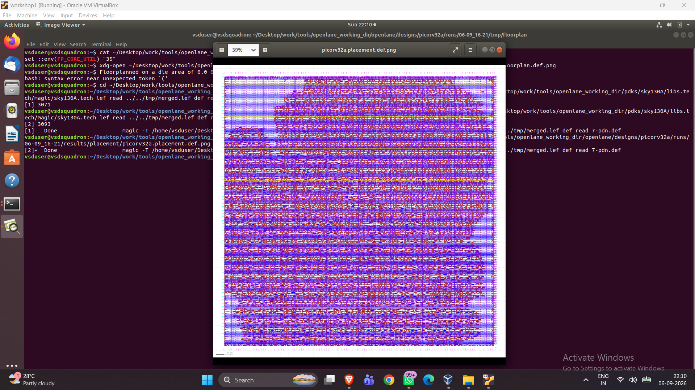
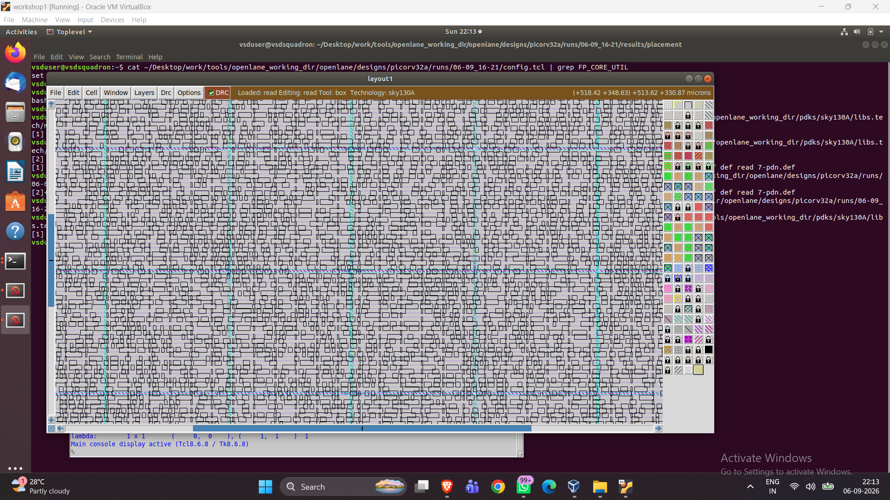
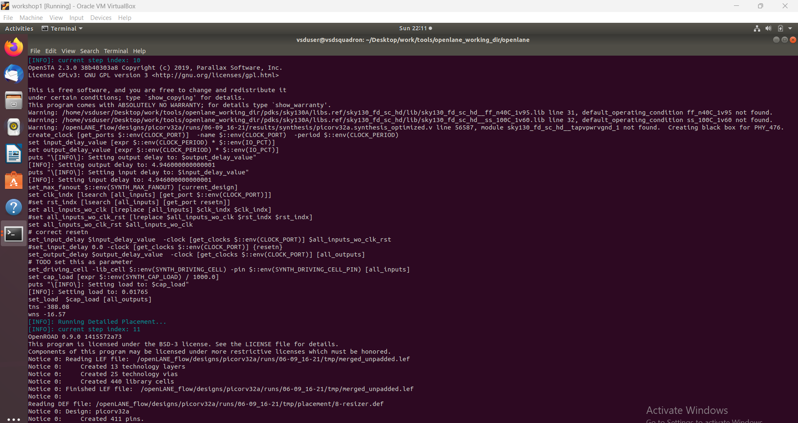

# Module 2 – Floorplanning, Placement and Power Distribution

## VSD – RTL to GDSII Workshop

Module 2 continues the OpenLane RTL-to-GDSII flow for the **picorv32a** design, picking up right after synthesis (Module 1). This stage covers **floorplanning, power distribution network (PDN) generation, tap/decap insertion, and standard-cell placement**, all run inside the `efabless/openlane:v0.21` interactive shell.

---

## 1. Where This Fits in the Flow

```text
RTL
 │
 ▼
Synthesis            ← Module 1
 │
 ▼
Floorplanning        ← Module 2
 │
 ▼
Power Distribution   ← Module 2
 │
 ▼
Placement            ← Module 2
 │
 ▼
Clock Tree Synthesis
 │
 ▼
Routing
 │
 ▼
GDSII
```

---

## 2. Starting OpenLane Interactive Mode

```bash
cd ~/Desktop/work/tools/openlane_working_dir/openlane
docker run -it -v $(pwd):/openLANE_flow -v $PDK_ROOT:$PDK_ROOT -e PDK_ROOT=$PDK_ROOT -u $(id -u $USER):$(id -g $USER) efabless/openlane:v0.21
```

Inside the container:

```bash
cd /openLANE_flow
./flow.tcl -interactive
```



```tcl
package require openlane 0.9
prep -design picorv32a
```

`prep` loads the RTL, PDK, standard-cell libraries, and timing configuration for the design.

---

## 3. Synthesis Recap — Flip-Flop Percentage

Synthesis (from Module 1) produced the following cell breakdown:

- Flip-flops (`sky130_fd_sc_hd__dfxtp_2`): **1613**
- Total cells: **14876**

```text
Flip-Flop Percentage = (1613 / 14876) × 100 = 10.84%
```



Roughly **10.84%** of the design is sequential logic; the rest is combinational and supporting cells (buffers, muxes, gates).

---

## 4. Floorplanning

```tcl
run_floorplan
```

Floorplanning defines the die and core dimensions, core utilization, aspect ratio, and standard-cell row structure. In this version of OpenLane, `run_floorplan` also automatically runs **I/O placement**, **tap/decap insertion**, and **PDN generation** as part of the same step.

### Core Utilization

```text
FP_CORE_UTIL = 35
```



A utilization of 35% leaves enough whitespace in the core for routing, power structures, and clock-tree elements.

### Floorplan Layout



### Die Area Calculation

From the generated DEF:

```text
UNITS DISTANCE MICRONS 1000 ;
DIEAREA ( 0 0 ) ( 660805 671405 )
```

```text
Width  = 660.805 µm
Height = 671.405 µm
Area   = 660.805 × 671.405 = 443,667.78 µm² ≈ 0.44367 mm²
```



### Core and Die (Magic View)

Opened using:

```bash
cd runs/<run_name>/tmp/floorplan
magic -T <path>/sky130A.tech lef read ../../tmp/merged.lef def read 7-pdn.def &
```


The screenshot shows the full core populated with standard-cell rows, tap cells at regular column intervals, and the die boundary surrounding the core.

---

## 5. Power Distribution Network (PDN)

PDN generation (part of `run_floorplan` in this OpenLane version) builds the power rings, straps, and standard-cell rails that distribute `VPWR`/`VGND` across the design.

```text
Lower Metal Layer  = met4
Upper Metal Layer  = met5
Rails Layer        = met1
Rail Width         = 0.48
```

### Supply Lines



The VPWR strap (met4/met5) is visible crossing the standard-cell rows, connecting down to the met1 rails that feed individual cells.

### Tap and Decap Cells

Endcap and tapcell insertion added:

```text
#Endcaps inserted:   476
#Tapcells inserted:  5878
```



Each `sky130_fd_sc_hd__tapvpwrvgnd_1` cell ties the local VPWR/VGND rails to the substrate/well, and helps stabilize local supply voltage against sudden switching current demand.

---

## 6. Placement

```tcl
run_placement
```

Placement assigns physical X/Y coordinates to every standard cell, in two stages: **global placement** (via RePlAce) followed by **resizer-based optimization** and **detailed placement/legalization**.

### Placement Stats

```text
total instances   21699
movable area       147800.5 u^2
utilization        36% (55% padded)
rows                238
```



### Zoomed Cell View



Individual standard cells and their rows are visible, with the power straps running across the placed design.

---

## 7. Timing Analysis — Before vs. After Placement

| Stage                     | WNS (ns) | TNS (ns) |
|---------------------------|---------:|---------:|
| Post-Synthesis            |  -24.89  |  -759.46 |
| Post-Placement (Resizer)  |  -16.57  |  -388.08 |



The resizer's buffer insertion and cell-resizing pass (101 input buffers, 307 output buffers, 61 additional buffers, 11364 resized instances) improved **WNS by ~8.3 ns** and **TNS by ~371 ns**, though the design still has setup violations that would need further optimization or a relaxed clock constraint in later stages.

---

## 8. Output Files

| File                                      | Description                                  |
|--------------------------------------------|-----------------------------------------------|
| `output_files/picorv32a.synthesis.v`        | Gate-level netlist from Module 1              |
| `output_files/picorv32a.synthesis_optimized.v` | Netlist after resizer optimization         |
| `output_files/picorv32a.floorplan.def`      | Floorplan DEF (die/core area, rows, PDN)      |
| `output_files/picorv32a.placement.def`      | Placement DEF (final cell coordinates)        |
| `output_files/3-verilog2def.die_area.rpt`   | Die area report                               |
| `output_files/3-verilog2def.core_area.rpt`  | Core area report                              |

---

## 9. Complete Command Sequence

```bash
# Start container
cd ~/Desktop/work/tools/openlane_working_dir/openlane
docker run -it -v $(pwd):/openLANE_flow -v $PDK_ROOT:$PDK_ROOT -e PDK_ROOT=$PDK_ROOT -u $(id -u $USER):$(id -g $USER) efabless/openlane:v0.21

# Inside container
cd /openLANE_flow
./flow.tcl -interactive
```

```tcl
prep -design picorv32a
run_synthesis
run_floorplan
run_placement
```

```bash
# View floorplan/PDN
magic -T <path>/sky130A.tech lef read ../../tmp/merged.lef def read 7-pdn.def &

# View placement
magic -T <path>/sky130A.tech lef read ../../tmp/merged.lef def read picorv32a.placement.def &
```

---

## 10. Key Learnings

- **Floorplan** establishes die/core boundaries and row structure before any cells are placed.
- **Core utilization (35%)** trades cell density for routing/power headroom.
- **PDN generation** (rings, straps, rails) and **tap/decap insertion** happen automatically as part of floorplanning in this OpenLane build — no separate `run_powerplan` call was needed.
- **Placement** is a two-pass process: global placement followed by resizer-driven optimization and legalization, which measurably improved timing (WNS/TNS) versus the raw post-synthesis numbers.
- Both floorplan and placement stages auto-generate a Klayout PNG snapshot of the DEF, in addition to the DEF file itself.

---

## What's Next

**Module 3** will cover **Clock Tree Synthesis (CTS)** and **Routing**, continuing toward a final GDSII output.

---

### Contributor

| Name | Workshop |
|------|----------|
| vsduser | VSD – RTL to GDSII Workshop |
